# 🏥 CareStaff & Client Scheduler

> **A full-stack scheduling platform for home-care agencies to manage care staff, clients, availability, and intelligent shift assignments with the help of AI.**

<div align="center">

[](https://nextjs.org)
[](https://tailwindcss.com)
[](https://www.typescriptlang.org)
[](https://github.com)
[](https://github.com)

</div>

This is a [Next.js](https://nextjs.org) project built with Tailwind CSS and the help of AI (Antigravity), bootstrapped with [`create-next-app`](https://nextjs.org/docs/app/api-reference/cli/create-next-app).

---

## 📖 About the Project

**CareStaff & Client Scheduler** is a full-stack web application designed to help **home-care agencies and care coordinators** efficiently manage staff rosters, client care requirements, and shift scheduling.

The application aims to simplify the complex process of matching:

* 👩‍⚕️ Care staff availability
* 🕐 Working hours and shift preferences
* 📍 Staff and client locations
* 👤 Client care requirements
* 📅 Preferred visit windows
* ⚖️ Weekly workload and capacity

The project was developed using **Next.js, TypeScript, and Tailwind CSS**, with assistance from **AI (Antigravity)** during development.

---
<div align="center">

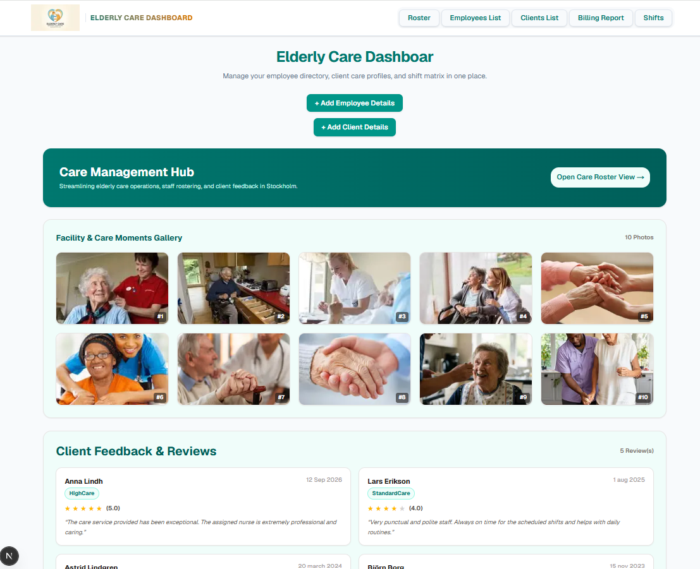

</div>

## 🎯 Problem & Target Users

### 💡 The Problem

Home-care scheduling often requires coordinators to manually match staff availability with client requirements.

This can become:

* ⏳ Time-consuming
* ❌ Prone to scheduling conflicts
* 📊 Difficult to manage as the number of clients grows
* 🧩 Complicated when considering location, working hours, and care requirements

**CareStaff & Client Scheduler** aims to provide a centralized solution for managing these challenges.

### 👥 Target Users

| User | Purpose |
| :--- | :--- |
| 👤 **Care Coordinators** | Plan weekly schedules, assign staff, and manage workloads |
| 🏢 **Home-Care Agencies** | Manage staff and clients from one centralized platform |
| 👩‍⚕️ **Care Administrators** | Maintain staff information and client care requirements |

---
<div align="center">

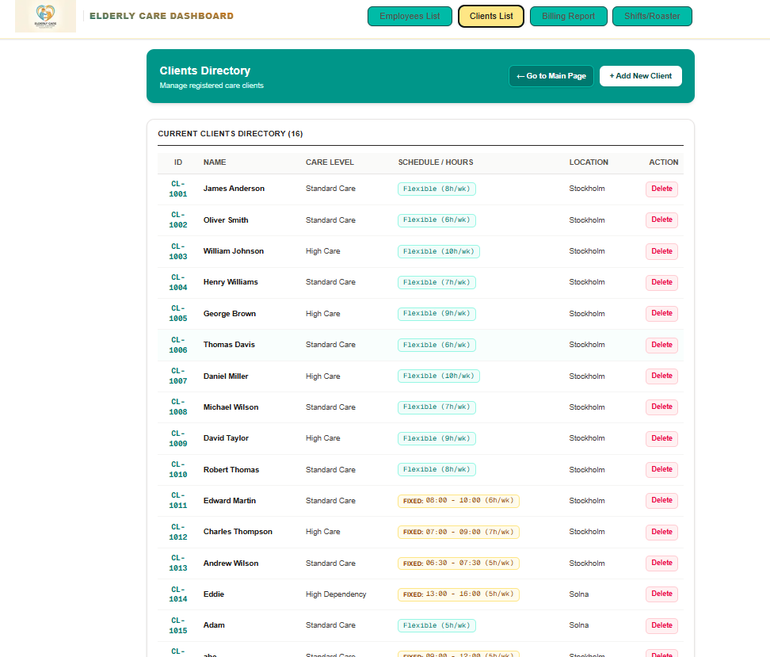

</div>


Employees List will be shown in a tab


<div align="center">

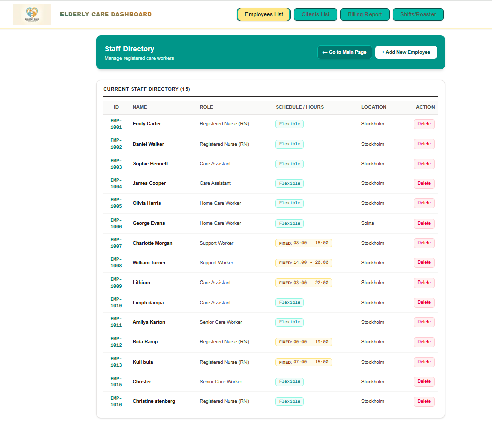

</div>


## ✨ Key Features

### 👩‍⚕️ Staff Management
* Add and manage care workers
* Define staff roles
* Assign staff locations
* Set maximum weekly working hours
* Configure flexible or fixed shifts
* View staff information in a centralized directory

<div align="center">

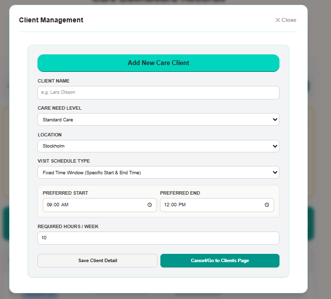

</div>

### 👤 Client Management
* Add and manage care recipients
* Define care dependency levels
* Set required weekly care hours
* Store client locations
* Configure fixed or flexible visit windows
* Maintain client care requirements

<div align="center">

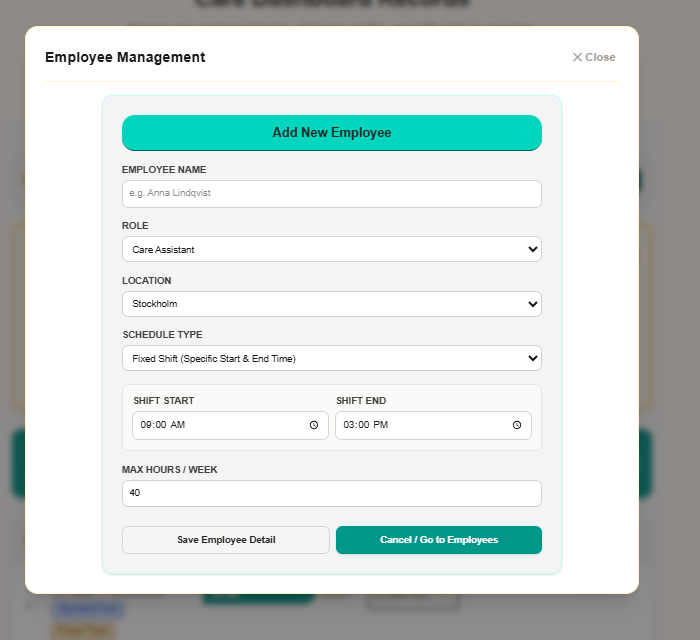

</div>

### 🤖 Automated Scheduling
The scheduling engine is designed to match staff and clients based on:
* 📍 Location compatibility
* 🕐 Schedule availability
* ⏱️ Working-hour limits
* 📅 Client visit requirements
* 👩‍⚕️ Staff capacity

  
<div align="center">


</div>


If it doesnot assign to all clients than we can assign manually


<div align="center">

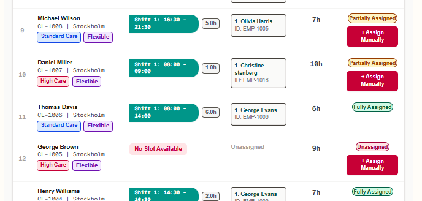

</div>

The form will open

<div align="center">

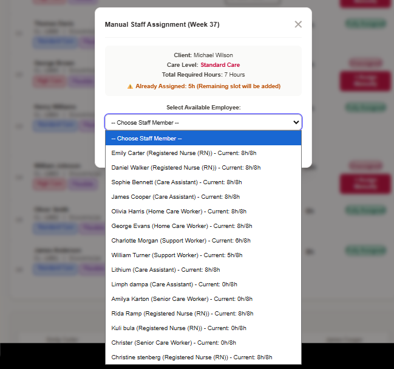

</div>

### 📱 Responsive Dashboard
* Modern dashboard interface
* Responsive layout
* Tailwind CSS styling
* Accessible UI components
* Easy navigation between staff and client directories
* Integrated creation and management forms


<div align="center">

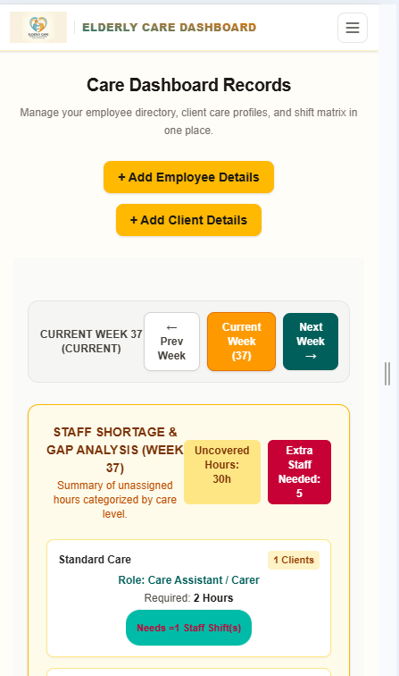

</div>


**Dynamic Client Invoicing:** Automatically calculates billable hours and total revenue based on client care levels and actual rostered delivery.
- **Role-Based Staff Payroll:** Computes regular and overtime pay dynamically according to employee qualifications and role-based hourly pay rates.
- **Overtime Calculation:** Automatically isolates overtime hours (hours exceeding 8 hours) and applies a **1.5x multiplier** to the hourly rate.
- **Tabbed Interface:** Easily toggle between **Client Invoicing Data** and **Payroll & Staff Hours**.
- **Overview Metrics:** High-level summary cards displaying total estimated client billing, total payroll cost, active client count, and active caregiver count.
- **One-Click CSV Export:** Export detailed financial and operational data for clients or staff directly to CSV format.

---

<div align="center">

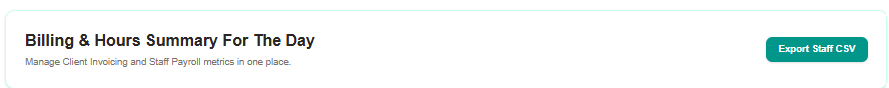

</div>


## Rate Structures

### Client Invoicing Rates
| Care Level | Hourly Rate (SEK) |
| :--- | :--- |
| **High Care** | 160 SEK |
| **Standard Care** | 150 SEK |
| **Basic Care** | 130 SEK |
**Client Report:** Includes Client ID, Name, Location, Care Level, Contract Hours, Delivered Hours, Hourly Rate, and Total Billable amount.
<div align="center">

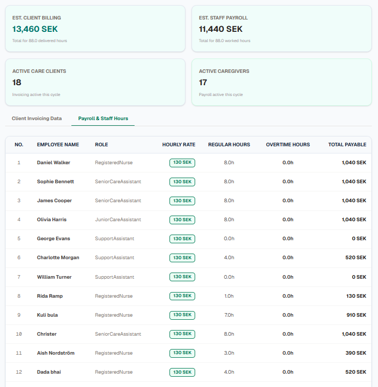

</div>

### Staff Payroll Rates
| Employee Role | Hourly Pay (SEK) |
| :--- | :--- |
| **Registered Nurse (RN)** | 180 SEK |
| **Senior Care Worker** | 170 SEK |
| **Support Worker** | 165 SEK |
| **Care Assistant** | 200 SEK |
 **Staff Report:** Includes Employee ID, Name, Role, Hourly Pay, Regular Hours, Overtime Hours, and Total Payable amount.
---
<div align="center">

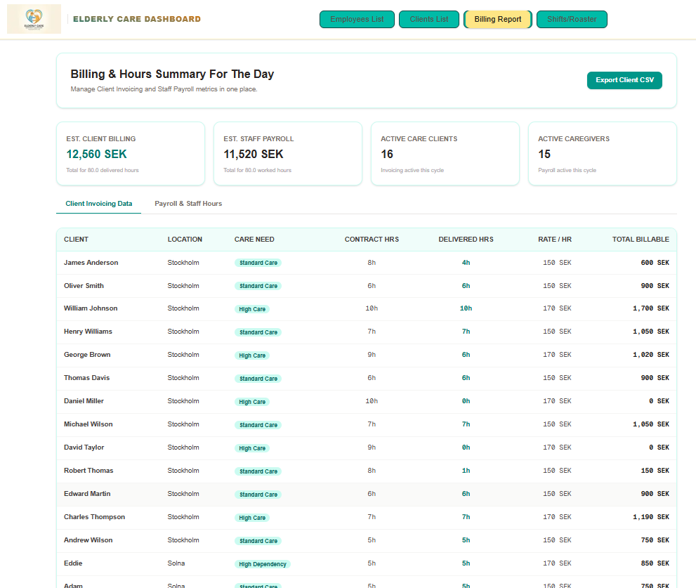

</div>

---

## Data Exports

The built-in `exportToCSV` utility generates dynamic CSV files depending on the active view:

One can download the  billing statement


[📥 View Project Report](./public/billing.csv)

## 🛠️ Technology Stack


<div align="center">


</div>


<div align="center">


| Technology | Purpose |
| :--- | :--- |
| ⚫ **Next.js** | Full-stack React framework and application routing |
| 🔷 **TypeScript** | Type safety and maintainable code |
| 🎨 **Tailwind CSS** | Responsive UI and styling |
| ⚛️ **React** | Interactive user interfaces and state management |
| 🔌 **REST API** | Communication between frontend and backend |
| 🤖 **Antigravity AI** | AI-assisted development and coding support |
| **State & Memoization:**| React `useState`, `useMemo` for high-performance data processing.|
| **Roster Engine:**| Integrates with `@/lib/rosterEngine` to parse JSON datasets (`employees.json`, `client.json`) and calculate task allocations and workloads.|

</div>

### Why These Technologies?

* **Next.js:** Used for its App Router, file-system routing, API route handlers, and client/server component architecture.
* **TypeScript:** Provides stronger type safety for API data, application models, and React components.
* **Tailwind CSS:** Allows rapid development of responsive and consistent user interfaces using utility-first styling.
* **React:** Used for interactive components, state management, and dynamic rendering.
* **REST API:** Provides structured communication between the frontend and backend data layer.
* **AI – Antigravity:** Used as a development assistant for code generation, debugging, refactoring, and exploring implementation approaches.

---

## 🏗️ Project Structure

```text
care-scheduler/
│
├── app/
│   ├── api/
│   ├── components/
│   ├── clients/
│   ├── staff/
│   ├── dashboard/
│   └── page.tsx
│
├── public/
│   └── images/
│
├── types/
│
├── package.json
├── tsconfig.json
├── next.config.ts
└── README.md
